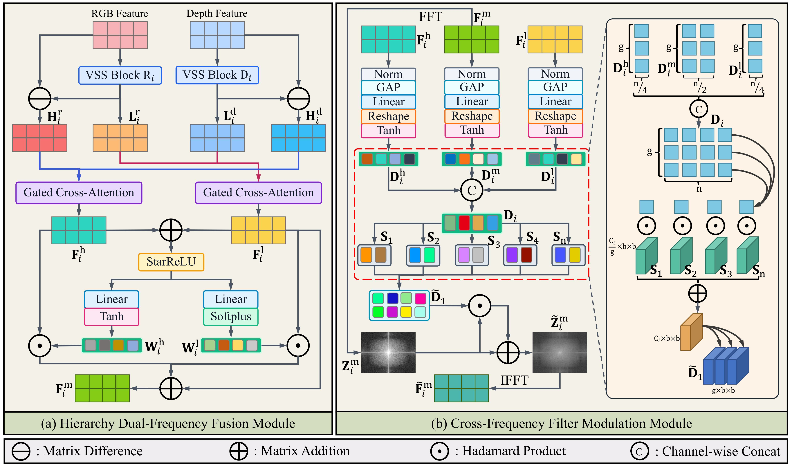
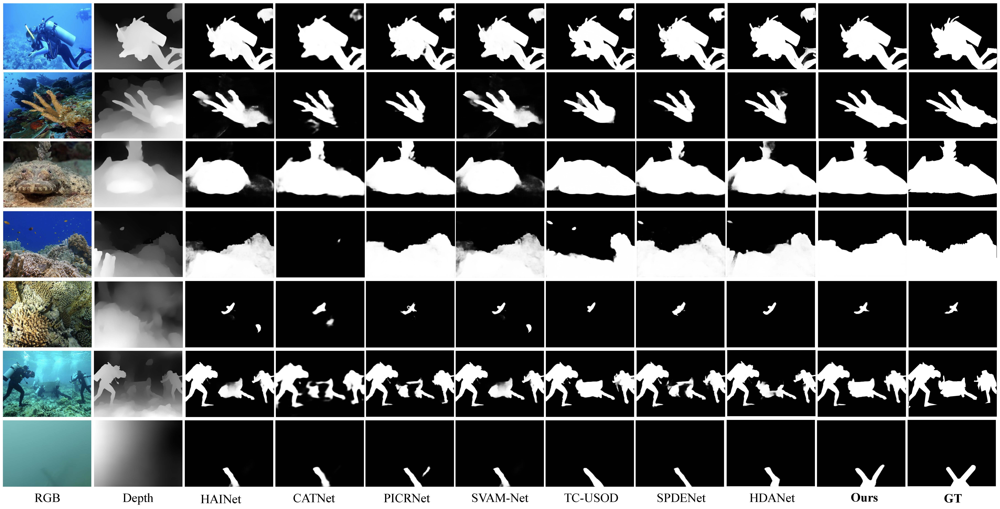

# Frequency-Decoupled Multimodal Fusion and Modulation for Underwater Salient Object Detection
### [[Paper]](https://arxiv.org/abs/2603.06231)

> [**Frequency-Decoupled Multimodal Fusion and Modulation for Underwater Salient Object Detection**](https://arxiv.org/abs/2507.17342)            
> [**Hao Zhou, Xu Yang, Hai Huang, Min Liu, Jie-Ming Ma, Chao-Meng Chen, Xu-Yao Zhang, Fei Luo**  
> **arXiv preprint arXiv:2603.06231**

## 🎞️ Pipeline
The pipelines of the two key modules: the Hierarchical Dual-Frequency Fusion Module (HDFM) and the Cross-Frequency Filter Modulation Module (CFMM).
<div align="center">
  
</div><br/>


## 🛠️ Get started

### Set up a new virtual environment
```
conda create -n FM2-Net python=3.8
conda activate FM2-Net
```

### Install dependency packages
```
pip install torch==2.0.0 torchvision==0.15.1 --index-url https://download.pytorch.org/whl/cu117
```

### Clone and Install FM2-Net
```
git clone https://github.com/zhouhao94/FM2-Net.git
cd FM2-Net
```

## 🕹️ Prepare the data
### Download the [USOD10K dataset](https://github.com/Underwater-Robotic-Lab/USOD10K/tree/main) and organize it as follows: 
````
   data
   |-- USOD10K
   |   |-- USOD10K-TR
   |   |-- |-- USOD10K-TR-RGB
   |   |-- |-- USOD10K-TR-GT
   |   |-- |-- USOD10K-TR-depth
   |   |-- |-- USOD10K-TR-Boundary
   |   |-- USOD10K-Val
   |   |-- |-- USOD10K-Val-RGB
   |   |-- |-- USOD10K-Val-GT
   |   |-- |-- USOD10K-Val-depth
   |   |-- |-- USOD10K-Val-Boundary
   |   |-- USOD10K-TE
   |   |-- |-- USOD10K-TE-RGB
   |   |-- |-- USOD10K-TE-GT
   |   |-- |-- USOD10K-TE-depth
````

## 🔥 Training and testing

### Training FM2-Net
1. Download the pretrained [VMamba](https://github.com/MzeroMiko/VMamba) weights: [VMamba_Tiny](https://github.com/zifuwan/Sigma/blob/main/pretrained/vmamba/vssmtiny_dp01_ckpt_epoch_292.pth), and place it in the `pretrained/vmamba/` directory. </u>

2. Then, run the following commands:
```
cd USOD
python3 train_test_eval.py --Training True --Testing True --Evaluation True
```

### Testing FM2-Net
1. Download either our fine-tuned [checkpoint](https://drive.google.com/file/d/185GTQM5C2BwfLu-SnnDtQGarkPpszAlD/view?usp=sharing) or your own trained checkpoint, and place it in the `checkpoint/` directory.
2. Then, run the following commands:
```
cd USOD
python3 train_test_eval.py --Testing True --Evaluation True
```

## ⭐ Results and checkpoints
FM2-Net achieves state-of-the-art performance on the USOD10K and USOD datasets, demonstrating its effectiveness for salient object detection in complex underwater scenes. We release the model [checkpoint](https://drive.google.com/file/d/185GTQM5C2BwfLu-SnnDtQGarkPpszAlD/view?usp=sharing) that delivers the best performance on both benchmarks.
### Results on the USOD10K dataset
| Models | S-measure ↑ | maxE ↑ | maxF ↑ | MAE ↓ |
| :-- | :-: | :-: | :-: | :-: |
| FM2-Net | 0.9285 | 0.9702 | 0.9276 | 0.0183 |

### Results on the USOD dataset
| Models | S-measure ↑ | maxE ↑ | maxF ↑ | MAE ↓ |
| :-- | :-: | :-: | :-: | :-: |
| FM2-Net | 0.9019 | 0.9379 | 0.9160 | 0.0414 |

### Qualitative Results
<div align="center">
  
</div><br/>


## ❤️ Acknowledgements
This project builds upon the excellent work of several open-source projects, including:
 - [USOD10K](https://github.com/Underwater-Robotic-Lab/USOD10K)
 - [Sigma](https://github.com/zifuwan/Sigma)
 - [FDAM](https://github.com/Linwei-Chen/FDAM)

We sincerely thank the authors and contributors for making their code publicly available.
